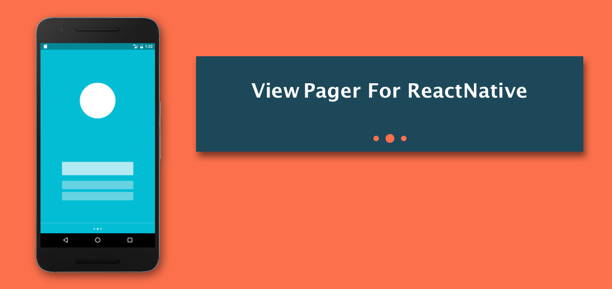
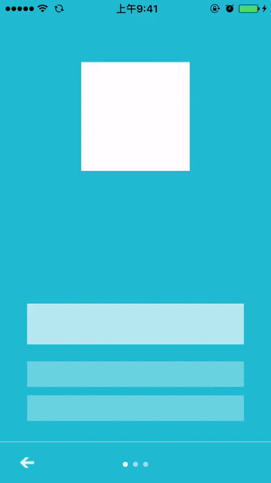
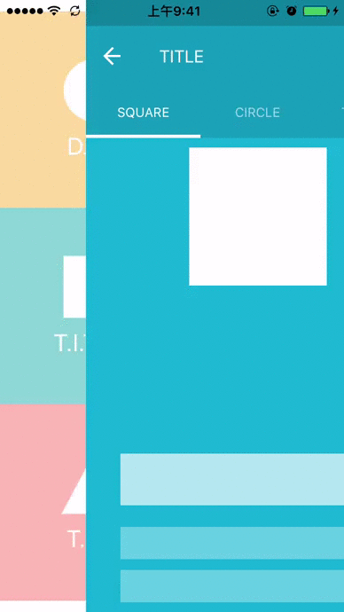
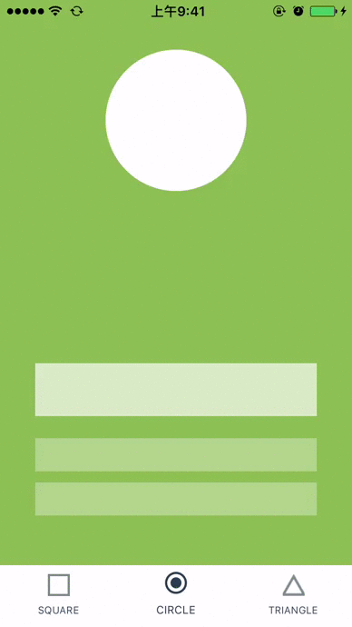

# React-Native-ViewPager
[](https://npmjs.org/package/rn-viewpager) [](https://npmjs.org/package/rn-viewpager) [](https://npmjs.org/package/rn-viewpager)

ViewPager and Indicator component for react-native on both android and ios. ViewPager's props is the same as [ViewPagerAndroid](https://facebook.github.io/react-native/docs/viewpagerandroid.html#content). 

<p>
    
</p>

## Features
- unify \<ViewPagerAndroid\> and \<ScrollView pagingEnabled={true}\> to \<ViewPager\>, add offer same props as [ViewPagerAndroid](https://facebook.github.io/react-native/docs/viewpagerandroid.html#content). 
- \<IndicatorViewPager\> component support render indicator
- implement common indicator: DotIndicator, TitleIndicator and TabIndicator


## Preview
[download demo apk file](http://fir.im/md2u)
<p>
    
    
    
</p>

## Build and run the demo

```  
cd RNViewPagerDemo/
npm install
react-native run-ios
```

## Component API

[`<ViewPager />` Component API](docs/viewpager.md)

[`<IndicatorViewPager />` Component API](docs/indicatorviewpager.md)

[`<PagerDotIndicator />` Component API](docs/dotindicator.md)

[`<PagerTabIndicator />` Component API](docs/tabindicator.md)

[`<PagerTitleIndicator />` Component API](docs/titleindicator.md)

## Usage

### Install from npm:
`npm install --save rn-viewpager`

### Integrate into your app:  

```jsx  

import {StyleSheet, View, Text} from 'react-native';
import React, {Component} from 'react';
import {PagerTabIndicator, IndicatorViewPager, PagerTitleIndicator, PagerDotIndicator} from 'rn-viewpager';

export default class ViewPagerPage extends Component {
    render() {
        return (
            <View style={{flex:1}}>
                <IndicatorViewPager
                    style={{height:200}}
                    indicator={this._renderDotIndicator()}
                >
                    <View style={{backgroundColor:'cadetblue'}}>
                        <Text>page one</Text>
                    </View>
                    <View style={{backgroundColor:'cornflowerblue'}}>
                        <Text>page two</Text>
                    </View>
                    <View style={{backgroundColor:'#1AA094'}}>
                        <Text>page three</Text>
                    </View>
                </IndicatorViewPager>

                <IndicatorViewPager
					style={{flex:1, paddingTop:20, backgroundColor:'white'}}
                    indicator={this._renderTitleIndicator()}
                >
                    <View style={{backgroundColor:'cadetblue'}}>
                        <Text>page one</Text>
                    </View>
                    <View style={{backgroundColor:'cornflowerblue'}}>
                        <Text>page two</Text>
                    </View>
                    <View style={{backgroundColor:'#1AA094'}}>
                        <Text>page three</Text>
                    </View>
                </IndicatorViewPager>
                
                <IndicatorViewPager
					style={{flex:1, paddingTop:20, backgroundColor:'white'}}
                    indicator={this._renderTabIndicator()}
                >
                    <View style={{backgroundColor:'cadetblue'}}>
                        <Text>page one</Text>
                    </View>
                    <View style={{backgroundColor:'cornflowerblue'}}>
                        <Text>page two</Text>
                    </View>
                    <View style={{backgroundColor:'#1AA094'}}>
                        <Text>page three</Text>
                    </View>
                </IndicatorViewPager>
            </View>
        );
    }

    _renderTitleIndicator() {
        return <PagerTitleIndicator titles={['one', 'two', 'three']} />;
    }

    _renderDotIndicator() {
        return <PagerDotIndicator pageCount={3} />;
    }
    
    _renderTabIndicator() {
        let tabs = [{
                text: 'Home',
                iconSource: require('../imgs/ic_tab_home_normal.png'),
                selectedIconSource: require('../imgs/ic_tab_home_click.png')
            },{
                text: 'Message',
                iconSource: require('../imgs/ic_tab_task_normal.png'),
                selectedIconSource: require('../imgs/ic_tab_task_click.png')
            },{
                text: 'Profile',
                iconSource: require('../imgs/ic_tab_my_normal.png'),
                selectedIconSource: require('../imgs/ic_tab_my_click.png')
        }];
        return <PagerTabIndicator tabs={tabs} />;
    }

}
```

## Note

When use this lib in ListView header on android platform, please add `removeClippedSubviews={false}` prop to your ListView.
