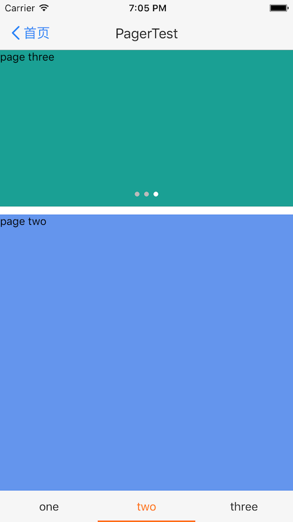
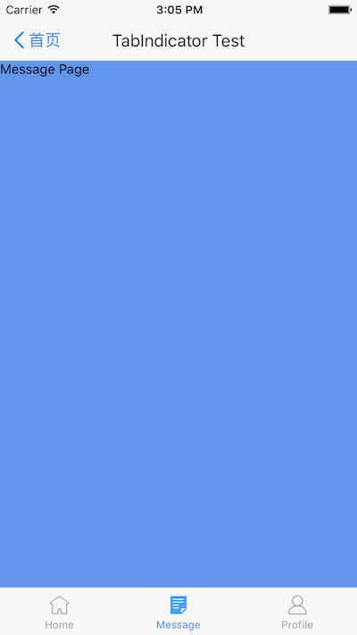

# React-Native-ViewPager
ViewPager and Indicator component for react-native on both android and ios. ViewPager's props is the same as [ViewPagerAndroid](https://facebook.github.io/react-native/docs/viewpagerandroid.html#content). 

## Features
- unify \<ViewPagerAndroid\> and \<ScrollView pagingEnabled={true}\> to \<ViewPager\>, add offer same props as [ViewPagerAndroid](https://facebook.github.io/react-native/docs/viewpagerandroid.html#content). 
- \<IndicatorViewPager\> component support render indicator
- implement common indicator: DotIndicator, TitleIndicator and TabIndicator


## Preview

<p>
  

</p>

## Build and run the demo

```  
cd demo/
npm install
react-native run-android
 
```

## Usage

### Install from npm:
`npm install --save rn-viewpager`

### Integrate into your app:  

```  
import React, {Component, StyleSheet, View, Text} from 'react-native';
import {IndicatorViewPager, PagerTitleIndicator, PagerDotIndicator} from 'rn-viewpager';


export default class ViewPagerPage extends Component {
    state = {
        count: 0
    };

    render() {
        console.log('render:' + this.state.count);
        return (
            <View style={{flex:1}}>
                <IndicatorViewPager
                    style={{height:200}}
                    indicator={this._renderDotIndicator()}
                >
                    <View style={{backgroundColor:'cadetblue'}}>
                        <Text>{'count' + this.state.count}</Text>
                    </View>
                    <View style={{backgroundColor:'cornflowerblue'}}>
                        <Text>page two</Text>
                    </View>
                    <View style={{backgroundColor:'#1AA094'}}>
                        <Text>page three</Text>
                    </View>
                </IndicatorViewPager>

                <IndicatorViewPager
                    style={{flex:1,marginTop:10}}
                    indicator={this._renderTitleIndicator()}
                >
                    <View style={{backgroundColor:'cadetblue'}}>
                        <Text>{'count' + this.state.count}</Text>
                    </View>
                    <View style={{backgroundColor:'cornflowerblue'}}>
                        <Text>page two</Text>
                    </View>
                    <View style={{backgroundColor:'#1AA094'}}>
                        <Text>page three</Text>
                    </View>
                </IndicatorViewPager>
                
                <IndicatorViewPager
                    style={{flex:1,marginTop:10}}
                    indicator={this._renderTabIndicator()}
                >
                    <View style={{backgroundColor:'cadetblue'}}>
                        <Text>{'count' + this.state.count}</Text>
                    </View>
                    <View style={{backgroundColor:'cornflowerblue'}}>
                        <Text>page two</Text>
                    </View>
                    <View style={{backgroundColor:'#1AA094'}}>
                        <Text>page three</Text>
                    </View>
                </IndicatorViewPager>
            </View>
        );
    }

    _renderTitleIndicator() {
        return (
            <PagerTitleIndicator
                titles={['one', 'two', 'three']}
            />
        );
    }

    _renderDotIndicator() {
        return (
            <PagerDotIndicator
                pageCount={3}
            />
        );
    }
    
    _renderTabIndicator() {
        let tabs = [
            {
                text: 'Home',
                iconSource: require('../imgs/ic_tab_home_normal.png'),
                selectedIconSource: require('../imgs/ic_tab_home_click.png')
            },
            {
                text: 'Message',
                iconSource: require('../imgs/ic_tab_task_normal.png'),
                selectedIconSource: require('../imgs/ic_tab_task_click.png')
            },
            {
                text: 'Profile',
                iconSource: require('../imgs/ic_tab_my_normal.png'),
                selectedIconSource: require('../imgs/ic_tab_my_click.png')
            }
        ];
        return (
            <PagerTabIndicator
                tabs={tabs}
            />
        );
    }

}
```

## Known issue
- onPageScrollStateChanged prop not support on iOS ):